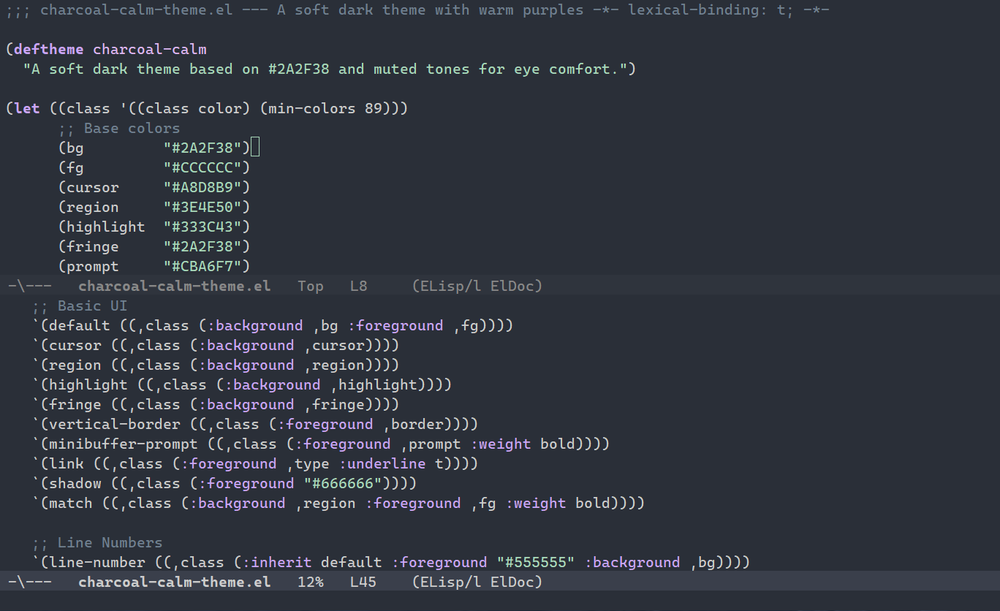

# charcoal-calm-theme

*A soft dark Emacs theme with warm purples, gentle greens, and a strong focus on eye comfort.*



## Overview

`charcoal-calm` is a dark Emacs theme designed for long coding sessions, writing, and general editing without eye strain. It emphasizes:

- A soft dark background `#2A2F38` with muted, non-intrusive contrast.
- Carefully curated colors for syntax highlighting using warm purples and calming greens.
- Full support for modern Emacs packages: `tree-sitter`, `corfu`, `vertico`, `marginalia`, `magit`, and `org-mode`.
- Italicized comments and doc strings for visual separation without distraction.

## Features

- 🌙 Soft dark background for low-light environments
- 🌈 Support for popular packages:
  - `tree-sitter`, `flycheck`, `flymake`
  - `company`, `corfu`, `orderless`
  - `org-mode`, `magit`, `dired`, `eshell`
  - `vertico`, `marginalia`, `which-key`
- ✨ Designed for minimal glare and comfortable contrast
- ✅ Fully customizable and easy to extend

## Installation

### From MELPA (pending)

Once published to MELPA:

```elisp
M-x package-install RET charcoal-calm-theme RET

Then, enable the theme:

```elisp
(load-theme 'charcoal-calm t)

### Manual Installation

Clone this repository into your Emacs config directory:

```sh
git clone https://github.com/yourusername/charcoal-calm-theme ~/.emacs.d/themes/charcoal-calm-theme

Add this to your config:

```elisp
(add-to-list 'custom-theme-load-path "~/.emacs.d/themes/charcoal-calm-theme")
(load-theme 'charcoal-calm t)

## Screenshots

### Customization

You can override specific face attributes in your config if you'd like to tweak contrast or accent tones:
```elisp
(custom-set-faces
 '(mode-line ((t (:background "#3B4252" :foreground "#E5E9F0")))))

### Contributing

Suggestions, bug reports, and contributions are welcome! Feel free to open an issue or PR.

### License

MIT

Made with ❤️ for focused, comfortable hacking.

```yaml

---

Let me know if you'd like a matching `screenshot.png` mockup to go with this or want help setting up the `melpa` metadata like `charcoal-calm-theme.el` headers or `charcoal-calm-theme-pkg.el`.
